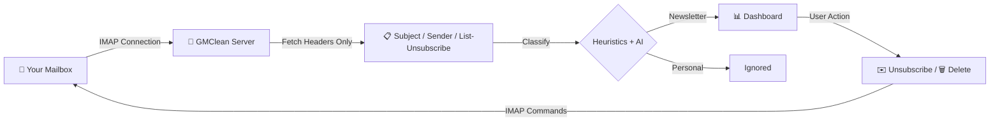

# ✉️ GMClean — Privacy-First Google & Microsoft Email Cleaner

**Google, Microsoft Clean — Self-hosted tool that scans your inbox, classifies emails, and lets you mass-unsubscribe, bulk-delete, and export — without ever sharing your data.**


---

## Why GMClean?

Services like **Unroll.me** and **Clean Email** promise inbox cleanup — but at a hidden cost. They [read and sell your email data](https://www.nytimes.com/2017/04/24/technology/personal-data-firm-slice-unroll-me-privacy-concerns.html), harvest purchase receipts, and build ad profiles from your private messages.

**GMClean is the zero-knowledge alternative.**

- 🚫 No cloud database — your data never leaves your machine
- 🚫 No email bodies — only headers are scanned (subject, sender, List-Unsubscribe)
- 🚫 No telemetry — zero tracking, zero analytics, zero data collection
- ✅ 100% self-hosted — runs entirely on your computer
- ✅ Open source — audit every line of code yourself

---

## Features

| | Feature | Description |
|---|---|---|
| 🔒 | **Privacy-First Scanning** | Headers-only analysis — email bodies are never downloaded |
| 📊 | **Inbox Analytics** | Interactive donut charts, top senders, newsletter-to-personal ratio |
| 📁 | **Multi-Folder Scanning** | INBOX, Spam, Promotions, Trash — any IMAP folder |
| ☑️ | **Multi-Select & Bulk Actions** | Select individual senders or Select All with a floating action bar |
| ✉️ | **One-Click Unsubscribe** | RFC 8058 compliant `List-Unsubscribe-Post` support |
| 🚫 | **Bulk Unsubscribe** | Unsubscribe from multiple senders at once with progress tracking |
| 🗑️ | **Bulk Delete** | Mass-delete emails by sender — batched for safety (500/batch) |
| 📤 | **Export Subscriptions** | Export selected senders to CSV with resubscribe links |
| 📥 | **Full Email Export** | Export all scanned emails to CSV for offline review |
| 🤖 | **AI Smart Boost** | Optional Gemini-powered classification for edge cases |
| 🛡️ | **Unsubscribe Tracking** | Detects senders who ignore your unsubscribe request |
| 🔑 | **Flexible Auth** | App Password + OAuth2 (Google, Microsoft) |
| 📱 | **Responsive Design** | Fully functional on desktop, tablet, and mobile |
| 💾 | **100% Local Storage** | All data stored in IndexedDB — nothing in the cloud |

---

## Quick Start

### Option 1: npm (Development)

```bash
git clone https://github.com/h-khalid-h/GMClean.git
cd GMClean
npm install
cp .env.example .env.local
# Edit .env.local with your ENCRYPTION_SECRET
npm run dev
```

Open [http://localhost:3000](http://localhost:3000)

### Option 2: Docker

```bash
docker run -p 3000:3000 \
  -e ENCRYPTION_SECRET=$(openssl rand -base64 32) \
  ghcr.io/h-khalid-h/gmclean:latest
```

### Option 3: Docker Compose

```bash
git clone https://github.com/h-khalid-h/GMClean.git
cd GMClean
cp .env.example .env.local
# Edit .env.local with your ENCRYPTION_SECRET
docker compose up -d
```

---

## Configuration

Copy `.env.example` to `.env.local` and configure:

| Variable | Required | Description |
|---|---|---|
| `ENCRYPTION_SECRET` | ✅ Yes | AES-256 key for credential encryption. Generate with `openssl rand -base64 32` |
| `GOOGLE_CLIENT_ID` | Optional | Google OAuth2 client ID for one-click Gmail login |
| `GOOGLE_CLIENT_SECRET` | Optional | Google OAuth2 client secret |
| `MICROSOFT_CLIENT_ID` | Optional | Microsoft OAuth2 client ID for Outlook login |
| `MICROSOFT_CLIENT_SECRET` | Optional | Microsoft OAuth2 client secret |

### App Password Setup

For quick setup without OAuth, use an **App Password**:

- **Gmail**: [Google App Passwords](https://myaccount.google.com/apppasswords) (requires 2FA enabled)
- **Outlook**: [Microsoft App Passwords](https://account.live.com/proofs/AppPassword)
- **Yahoo**: [Yahoo App Passwords](https://login.yahoo.com/account/security/app-passwords)
- **Any IMAP server**: Use your mail provider's documentation

---

## How It Works



1. **Connect** via IMAP using an App Password or OAuth2
2. **Fetch** email headers only — subject, sender, `List-Unsubscribe` (NO body content)
3. **Classify** using heuristic rules + optional Gemini AI for ambiguous cases
4. **Store** results locally in IndexedDB (your browser, your machine)
5. **Act** — multi-select senders, bulk-unsubscribe, bulk-delete, or export to CSV

---

## Privacy

> **Your email content is NEVER downloaded. Period.**

- 📨 Only email **headers** are fetched — subject line, sender address, and unsubscribe links
- 🔐 Credentials are encrypted with **AES-256-CBC** before storage
- 💻 Zero cloud dependencies — the entire app runs on **your machine**
- 🚫 No telemetry, no tracking cookies, no analytics scripts
- 🗄️ All data lives in your browser's **IndexedDB** — clear it anytime
- 📖 Fully open source — audit the code yourself

---

## Tech Stack

| Layer | Technology |
|---|---|
| Framework | [Next.js 16](https://nextjs.org/) (App Router) |
| UI | [React 19](https://react.dev/) |
| IMAP Client | [ImapFlow](https://imapflow.com/) |
| Local Storage | [Dexie.js](https://dexie.org/) (IndexedDB wrapper) |
| Icons | [Lucide React](https://lucide.dev/) |
| Styling | Pure CSS (no Tailwind) |
| Language | TypeScript 5 |

---

## Contributing

Contributions are welcome! Here's how to get started:

1. **Fork** the repository
2. **Create** a feature branch: `git checkout -b feature/amazing-feature`
3. **Commit** your changes: `git commit -m 'Add amazing feature'`
4. **Push** to the branch: `git push origin feature/amazing-feature`
5. **Open** a Pull Request

Please make sure your code:
- Passes `npm run lint` with no errors
- Follows the existing code style
- Includes appropriate comments for complex logic

---

## License

This project is licensed under the **MIT License** — see the [LICENSE](LICENSE) file for details.

---

<p align="center">
  <b>Built with ❤️ for people who value their privacy.</b>
</p>
